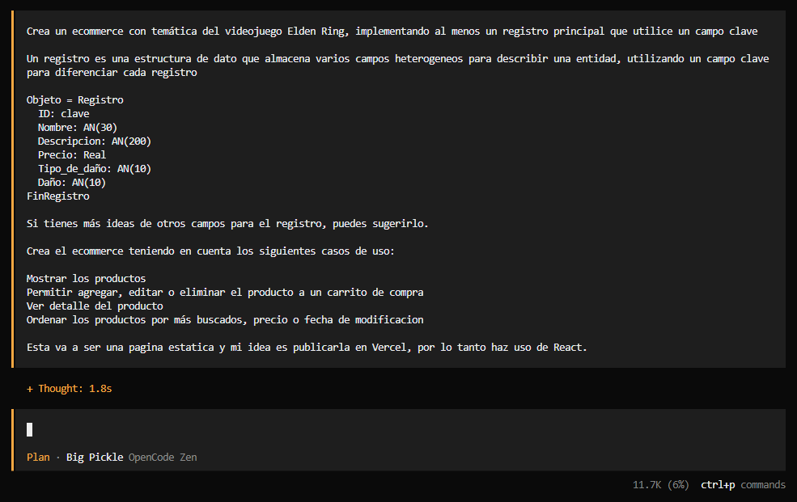
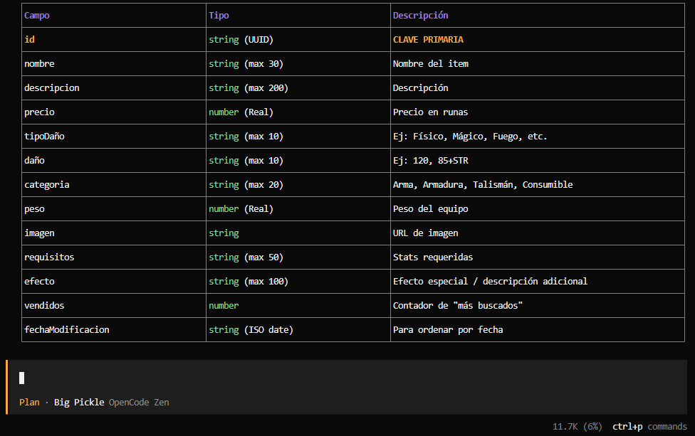
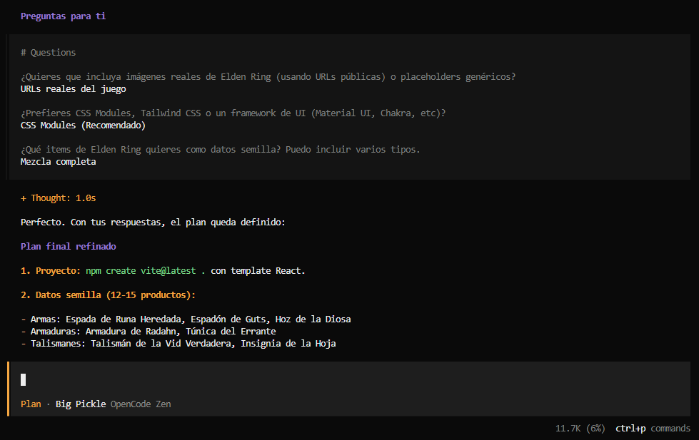
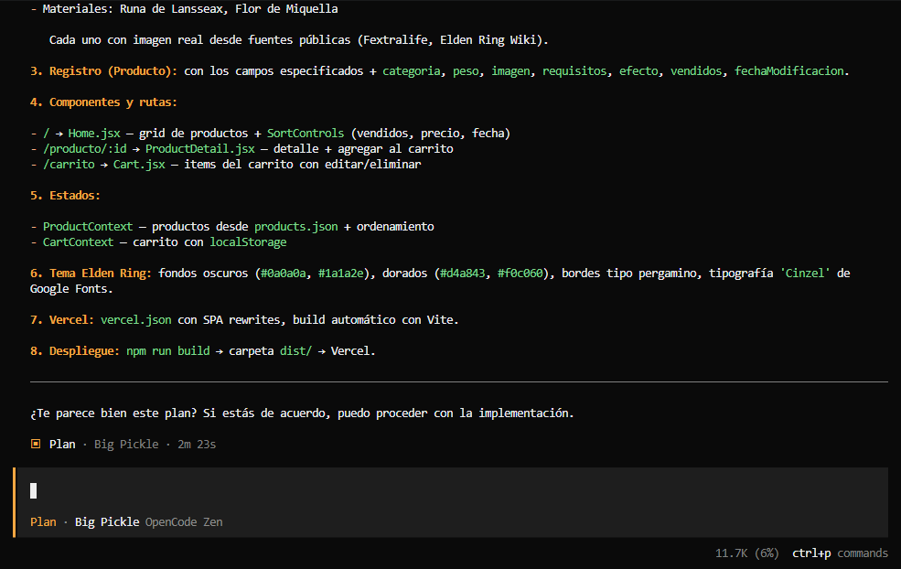
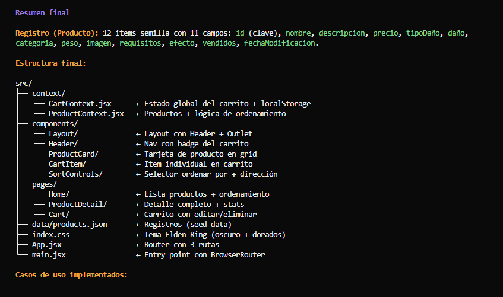
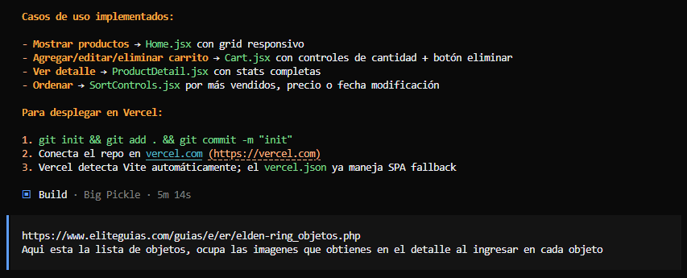
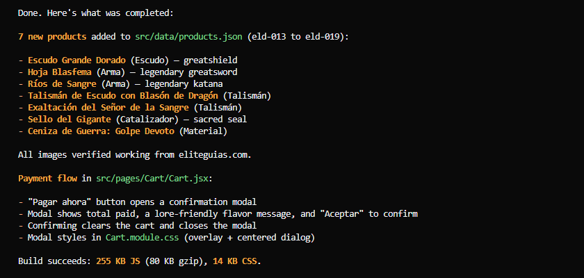

# Elden Bazaar 🎮

**Materia:** Algoritmo y Estructura de Datos  
**Alumno:** Ferreira Axel  
**Comisión:** K1.3  
**Legajo:** 28834  

## Descripción

E-commerce orientado al mundo de los videojuegos, diseñado para que los amantes de *Elden Ring* puedan adquirir todos aquellos objetos, armas y elementos que el juego ofrece y han soñado con poseer.

## Diseño del Registro

| Campo | Tipo |
|---|---|
| ID (Clave) | AN(20) |
| Nombre | AN(30) |
| Descripción | AN(200) |
| Precio | Real |
| TipoDaño | AN(20) |
| Daño | Entero |
| Categoria | AN(20) |
| Peso | Real |
| Imagen | AN(200) |
| Requisitos | AN(30) |
| Efectos | AN(30) |
| Vendidos | Entero |
| fechaModificacion | Año: N(4), Mes: 1..12, Día: 1..31 |

El campo **ID** se definió como campo clave porque es un valor único de cada elemento que permite identificar inequívocamente cada registro, a diferencia de otros campos como peso, precio o categoría.

## Capturas de Pantalla

| | |
|---|---|
|  |  |
|  |  |
|  |  |
|  |  |

## URL de la App

[https://trabajo-ecommerce.vercel.app/](https://trabajo-ecommerce.vercel.app/)

## Video Demostrativo

<video src="WhatsApp%20Video%202026-06-22%20at%209.10.19%20PM.mp4" controls width="100%"></video>

## Reflexión

La implementación de una herramienta de soporte como la IA facilita enormemente la forma en la que se diseñan las páginas web. Partir de una idea, pensar su diseño y estructura, y luego poder ejecutarla es una labor que un desarrollador podría demorarse incluso días o semanas en llevar a cabo. Sin embargo, utilizando inteligencia artificial no solo se facilita el diseño y la forma, sino que también otorga ideas al programador para poder crear algo innovador y más amigable con el usuario, acortando enormemente el tiempo de respuesta, detección de problemas y solución de los mismos.
